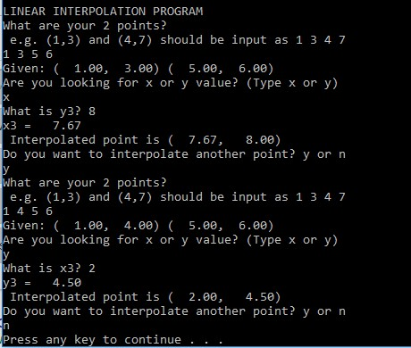

# Interpolation
## Linear interpolation between 2 points.

This program will interpolate a 3rd point when given 2 points. 
More specifically, it can give an interpolated x-point when given a y-point, or an interpolated y-point when given an x-point.

## Purpose
This is useful in intro engineering classes, e.g. interpolating a temperature in a steam table. I wrote a simpler version of this program for my TI calculator. Using this program for homework should make the process much faster.

## Installation

Use a compiler such as Visual Studio's Developer command prompt. Assuming interp.c is in the folder, C:/interp, you would use this:
```
cd c:/interp
cl interp.c
```

## Running the Program
After compiling the code, you can run the program on the command prompt or open the exe file.


You can run the interpolation code as many times as you'd like. The program runs in a while loop.
